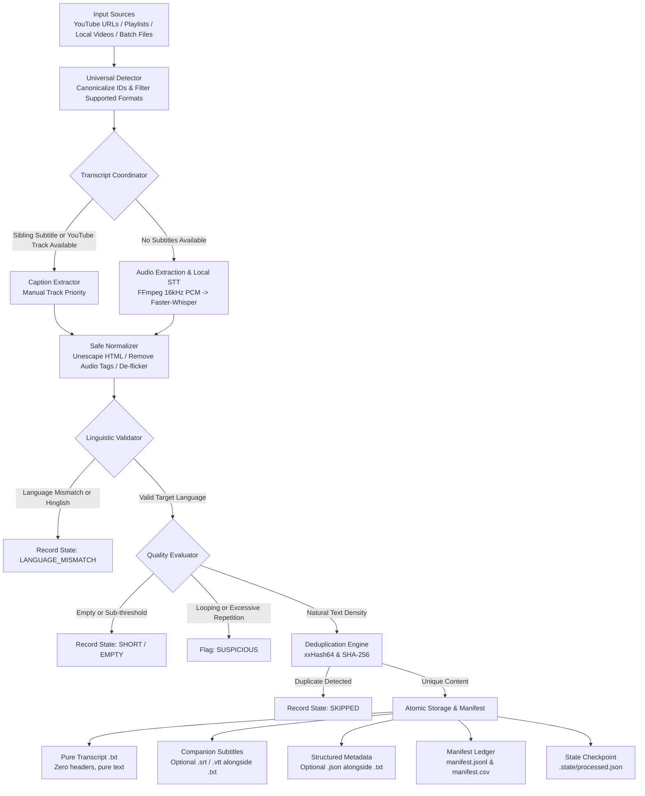

# Textora Engine

<p align="center">
  <strong>Universal Video-to-Text Pipeline & Dataset Collection Tool</strong>
</p>

<p align="center">
  <a href="#key-features">Key Features</a> •
  <a href="#pipeline-architecture">Architecture</a> •
  <a href="#installation">Installation</a> •
  <a href="#cli-usage--examples">CLI Usage</a> •
  <a href="#python-api-usage">Python API</a> •
  <a href="#dataset-manifest--schema">Manifest & Schema</a> •
  <a href="#testing--verification">Testing</a> •
  <a href="#license">License</a>
</p>

<p align="center">
  
  
  
  
  
</p>

---

## Overview

**Textora Engine** is a deterministic, modular pipeline engineered to ingest video sources—YouTube videos, playlists, local media files, and batch inventories—and transform them into clean, reliable, dataset-ready plain text corpora.

Designed specifically for **LLM pretraining, fine-tuning, RAG indexing, and NLP corpus curation**, Textora Engine enforces strict linguistic validation, eliminates duplicate rolling caption flickers, categorizes quality tiers, avoids redundant compute via intelligent caption-first routing, and writes files atomically with crash-safe state resumption.

---

## The Problem: Why Traditional Video Scraping Breaks

Building high-quality text corpora from video content poses several practical engineering challenges:

1. **Caption Flicker Duplication**: Automated YouTube subtitles stream progressively, often repeating preceding words across consecutive time segments. Naive extraction produces repetitive text that can degrade language model training quality.
2. **Audio Annotation Noise**: Non-lexical markers such as `[Music]`, `[Applause]`, `(Laughter)`, and `(inaudible)` introduce noisy tokens into text corpora.
3. **Metadata & Header Contamination**: Generic tools often inject titles, URLs, timestamps, or markdown headers (`---`, `# Title`) into output text files, contaminating datasets where only spoken prose is expected.
4. **Redundant Compute**: Running speech-to-text (e.g. Whisper) across hundreds of hours of video when human-curated or embedded subtitles are already present wastes hours of GPU/CPU compute.
5. **Language Drift & Transliterated Noise**: Simple scrapers frequently fail to detect when subtitles are non-target scripts or Latin-script transliterated text (e.g., Hinglish) rather than standard English.
6. **Process Interruptions**: Network timeouts or corrupt media files during large batches can cause unhandled failures or leave partially written, corrupted files on disk.

---

## The Solution: How Textora Engine Operates

Textora Engine addresses each failure mode through a structured, multi-stage pipeline:

- **Caption-First Dual Engine**: Checks for manual and automatic captions (for YouTube) or sibling subtitle files (`.srt`, `.vtt` for local video). It only routes audio through local Speech-to-Text (`faster-whisper`) when captions are absent or when STT is explicitly requested.
- **Deterministic Rule-Based Normalization**: Strips audio annotations, unescapes HTML entities, and eliminates overlapping caption flickers deterministically using regex and string rules—**without using generative models or hallucinating text**.
- **Pure Plain Text Output**: Primary transcript `.txt` files contain **strictly spoken text**. Zero metadata headers, zero timestamps, and zero generated commentary. Structured metadata is preserved separately in companion formats and `manifest.jsonl`.
- **Multi-Layer Language Filtering**: Enforces language boundaries, rejects non-Latin scripts in English mode, flags transliterated Hinglish via vocabulary-ratio analysis, and preserves scientific and technical terms.
- **Content-Addressable Deduplication**: Uses fast 64-bit `xxhash` for content fingerprinting alongside SHA-256 archival verification to prevent duplicate processing.
- **Crash-Safe Checkpointing & Resumption**: Atomic temporary writes prevent partial file corruption, while `.state/` ledgers track successes and failures for instantaneous, lossless batch resumption.
- **Dataset Integrity Verification (`textora-engine validate`)**: Computes SHA-256 checksums of on-disk transcripts to verify that files match manifest records, detecting missing, modified, or unindexed files.

---

## Pipeline Architecture



---

## Project Structure

```text
TextoraEngine/
├── src/
│   └── textora_engine/
│       ├── __init__.py               # Package metadata and version info
│       ├── __main__.py               # python -m textora_engine entry point
│       ├── cli.py                    # Typer & Rich CLI subcommands
│       ├── config.py                 # TextoraConfig definition & TOML parser
│       ├── exceptions.py             # Structured error hierarchy
│       ├── models.py                 # Core domain models & dataclasses
│       ├── pipeline.py               # Central execution pipeline orchestrator
│       ├── dedup/
│       │   ├── __init__.py
│       │   └── fingerprint.py        # xxHash64, SHA-256, and DedupRegistry
│       ├── discovery/
│       │   ├── __init__.py
│       │   ├── detector.py           # Universal input resolver (URLs, dirs, files)
│       │   └── youtube.py            # YouTube playlist crawler & metadata
│       ├── language/
│       │   ├── __init__.py
│       │   └── validator.py          # Script detection, Hinglish filter, langdetect
│       ├── media/
│       │   ├── __init__.py
│       │   ├── extractor.py          # FFmpeg audio conversion to 16kHz mono WAV
│       │   └── ffmpeg_util.py        # System and bundled FFmpeg discovery
│       ├── normalization/
│       │   ├── __init__.py
│       │   └── cleaner.py            # Entity unescaping, de-flickering, tag removal
│       ├── quality/
│       │   ├── __init__.py
│       │   └── evaluator.py          # Quality tier classification & n-gram loops
│       ├── reporting/
│       │   ├── __init__.py
│       │   ├── console.py            # Rich terminal tables, status, and summary
│       │   └── summary.py            # Aggregate run statistics and stats.json
│       ├── state/
│       │   ├── __init__.py
│       │   └── checkpoint.py         # Crash-safe checkpointing (.state/ ledger)
│       ├── storage/
│       │   ├── __init__.py
│       │   ├── formatter.py          # SRT and WebVTT subtitle formatting
│       │   ├── manifest.py           # Thread-safe manifest.jsonl & CSV logging
│       │   └── writer.py             # Atomic file writes & pure .txt formatting
│       ├── stt/
│       │   ├── __init__.py
│       │   ├── base.py               # BaseSTTProvider interface
│       │   ├── faster_whisper_provider.py  # Local faster-whisper implementation
│       │   └── mock_provider.py      # Deterministic mock STT for testing
│       ├── transcripts/
│       │   ├── __init__.py
│       │   ├── coordinator.py        # Caption vs. STT dual-engine router
│       │   ├── local_captions.py     # Local SRT/VTT file discovery & parser
│       │   └── youtube_captions.py   # youtube-transcript-api integration
│       └── validation/
│           ├── __init__.py
│           └── dataset_scanner.py    # Offline dataset validator & hash auditor
├── tests/
│   ├── conftest.py                   # Pytest fixtures and mock setups
│   ├── test_cli.py                   # CLI subcommand invocation tests
│   ├── test_coordinator_stt.py       # Dual-engine fallback & routing tests
│   ├── test_dedup.py                 # Fingerprinting & duplicate registry tests
│   ├── test_discovery.py             # URL canonicalization & batch file tests
│   ├── test_e2e_real_world.py        # 13-scenario end-to-end real validation suite
│   ├── test_language.py              # Script, Hinglish, & technical vocab tests
│   ├── test_normalization.py         # Entity, tag removal, & de-flicker tests
│   ├── test_quality.py               # Tiering (GOOD, SHORT, SUSPICIOUS, EMPTY)
│   └── test_storage_state.py         # Atomic persistence, resume, & manifest tests
├── .gitignore                        # Comprehensive exclusions (caches, state, output)
├── LICENSE                           # MIT License
├── pyproject.toml                    # PEP 621 packaging metadata & CLI entry points
└── README.md
```

---

## Installation

### Requirements
- **Python**: `3.10` or higher
- **FFmpeg**: Required only for local video audio extraction. If FFmpeg is not installed on your system `PATH`, install `imageio-ffmpeg` via `pip install imageio-ffmpeg` or use the `[stt]` extra below.

### 1. Basic Installation (Captions, YouTube, & Dataset Tools)
Clone the repository and install in editable mode:

```bash
git clone https://github.com/Pranay-Kumar-02/textora-engine.git
cd textora-engine
pip install -e .
```

### 2. Full Installation (Local Speech-to-Text with Faster-Whisper)
To enable local audio transcription for videos lacking captions:

```bash
pip install -e ".[stt]"
```

### 3. Development Installation (Including Pytest)
```bash
pip install -e ".[dev,stt]"
```

### 4. Verify System Readiness
Run the built-in system diagnostics tool to audit your runtime, dependencies, FFmpeg availability, and write permissions:

```bash
textora-engine doctor
```

Output example:
```text
                       Textora Engine System Diagnostics                       
+-----------------------------------------------------------------------------+
| Component                 | Status          | Details / Recommendations     |
|---------------------------+-----------------+-------------------------------|
| Python Runtime            | OK              | Version 3.12.5                |
| Dependency: typer         | OK              | CLI interface framework       |
| Dependency: rich          | OK              | Terminal UI & formatting      |
| Dependency: youtube_api   | OK              | YouTube transcript engine     |
| Dependency: langdetect    | OK              | Deterministic language filter |
| Dependency: xxhash        | OK              | Fast 64-bit content hashing   |
| Media: FFmpeg             | FOUND           | Available on PATH / imageio   |
| STT: faster-whisper       | AVAILABLE       | Local Whisper engine ready    |
| Filesystem Access         | WRITABLE        | Read/write access confirmed   |
+-----------------------------------------------------------------------------+
```

---

## CLI Usage & Examples

You can run Textora Engine using either the installed command line alias:
```bash
textora-engine <command> [options]
# or: textora <command> [options]
```
or via the Python module syntax:
```bash
python -m textora_engine <command> [options]
```

### 1. Preview Sources Before Processing
Preview discovered sources without downloading transcripts or executing STT:

```bash
textora-engine preview https://www.youtube.com/watch?v=dQw4w9WgXcQ
```

Preview an entire YouTube playlist:
```bash
textora-engine preview --playlist "https://www.youtube.com/playlist?list=PLZHQObOWTQDPD3MizzM2xVFitgF8hE_ab"
```

### 2. Single Video Extraction
Extract transcript from a YouTube video to a target dataset folder:

```bash
textora-engine extract https://www.youtube.com/watch?v=dQw4w9WgXcQ --output ./my_dataset
```

Extract from a local video file (automatically detects sibling subtitles like `.srt` if present):
```bash
textora-engine extract ./raw_lecture.mp4 --output ./my_dataset
```

### 3. Batch Extraction from File
Process a batch list of URLs or file paths (one per line, blank lines and `#` comments ignored):

```bash
textora-engine extract --file sources.txt --output ./my_dataset
```

Example `sources.txt`:
```text
# Machine learning lectures
https://www.youtube.com/watch?v=dQw4w9WgXcQ
./recordings/lecture_01.mp4 # Sibling lecture_01.en.srt used if available
./recordings/interview.mkv  # Falls back to local Whisper STT if no subtitles
```

### 4. YouTube Playlist Extraction
Crawl and extract an entire public playlist with individual failure isolation:

```bash
textora-engine extract --playlist "https://www.youtube.com/playlist?list=PLZHQObOWTQDPD3MizzM2xVFitgF8hE_ab" --output ./linear_algebra
```

### 5. Multi-format Exports (Subtitles & JSON Metadata)
Export companion `.srt`, `.vtt`, and `.json` metadata alongside pure `.txt` files:

```bash
textora-engine extract ./talk.mp4 --output ./output --export-srt --export-vtt --export-json --export-csv
```

### 6. Streaming Dataset Export (`.jsonl`)
Stream processed items directly to a unified JSONL dataset file (ideal for pretraining data ingestion):

```bash
textora-engine extract --file video_list.txt --output ./dataset --export-jsonl ./dataset/train_corpus.jsonl
```

### 7. Resume Interrupted Batches
If a large batch is interrupted, rerun the exact same command. Textora Engine checks `.state/processed.json` and skips completed items instantaneously:

```bash
textora-engine extract --file large_list.txt --output ./dataset --resume
```

To re-run only items that failed previously:
```bash
textora-engine retry ./dataset
# or: textora-engine extract --file large_list.txt --output ./dataset --retry-failed
```

### 8. Validate Dataset Integrity
Perform a checksum disk audit of the output directory against `manifest.jsonl`:

```bash
textora-engine validate ./dataset
```

Output example:
```text
       Dataset Integrity Audit: ./dataset       
+-------------------------------------+---------+
| Audit Check                         |  Result |
|-------------------------------------+---------|
| Overall Health                      | HEALTHY |
| Manifest Records                    |      16 |
| Verified Files on Disk              |      16 |
| Missing Files                       |       0 |
| Corrupt / Empty Files               |       0 |
| Hash Mismatches                     |       0 |
| Unindexed Files                     |       0 |
| Total Verified Words                |  28,450 |
| Total Verified Characters           | 164,120 |
+-------------------------------------+---------+
```

### 9. View Dataset Statistics
Display summary metrics for an existing dataset directory:

```bash
textora-engine stats ./dataset
```

---

## Complete CLI Options Reference

```text
Usage: textora-engine extract [OPTIONS] [INPUTS]...

Arguments:
  [INPUTS]...                     Video URLs, local file paths, or directories.

Options:
  -f, --file PATH                 Input file with URLs or paths, one per line.
  -p, --playlist TEXT             YouTube playlist URL to crawl and process.
  -o, --output PATH               Target dataset output directory [default: ./output].
  -l, --language TEXT             Language code filter ('auto', 'en', 'es', etc.) [default: auto].
  --transcript-source TEXT        Acquisition strategy: 'auto', 'captions', 'stt' [default: auto].
  --stt-backend TEXT              Speech-to-text engine backend [default: faster-whisper].
  --stt-model TEXT                STT model size: 'tiny', 'base', 'small', 'medium' [default: base].
  --group-by TEXT                 Directory grouping: 'none', 'source', 'language' [default: none].
  --min-words INTEGER             Minimum word count threshold [default: 20].
  --min-characters INTEGER        Minimum character count threshold [default: 100].
  -w, --workers INTEGER           Worker count for processing [default: 1].
  --dry-run                       Simulate discovery and pipeline without writing files.
  --force                         Force reprocessing even if present in state ledger.
  --resume / --no-resume          Skip already processed videos [default: --resume].
  --retry-failed                  Retry previously failed items recorded in state.
  --export-srt                    Export companion SubRip (.srt) subtitle files.
  --export-vtt                    Export companion WebVTT (.vtt) subtitle files.
  --export-json                   Export companion JSON files with timestamp segments.
  --export-jsonl PATH             Stream all processed records to a single JSONL file.
  --export-csv / --no-csv         Generate manifest.csv alongside manifest.jsonl [default: True].
  -v, --verbose                   Enable verbose debug logging.
  -q, --quiet                     Suppress non-error terminal output.
  --help                          Show help message and exit.
```

---

## Python API Usage

Textora Engine can also be used directly in Python scripts and data pipelines:

```python
from pathlib import Path
from textora_engine.config import TextoraConfig
from textora_engine.pipeline import TextoraPipeline
from textora_engine.discovery.detector import discover_inputs

# Configure pipeline settings
config = TextoraConfig(
    output_dir=Path("./my_dataset"),
    language="en",
    min_words=20,
    export_srt=True,
    export_json=True,
)

# Initialize pipeline and discover inputs
pipeline = TextoraPipeline(config)
sources = discover_inputs([
    "https://www.youtube.com/watch?v=dQw4w9WgXcQ",
    "./recordings/lecture_01.mp4",
])

# Execute batch processing
summary = pipeline.run(sources)
print(f"Processed: {summary.processed}, Words: {summary.total_words:,}")
```

### Configuration via TOML
You can load configuration settings programmatically from a standard TOML file via `TextoraConfig.load_from_toml(path)`:

```toml
# textora.toml
output_dir = "./curated_dataset"
language = "en"
transcript_source = "auto"
stt_backend = "faster-whisper"
stt_model = "base"
group_by = "none"
min_words = 30
min_characters = 150
workers = 1
export_srt = true
export_vtt = false
export_json = true
export_csv = true
```

Load in Python:
```python
config = TextoraConfig.load_from_toml(Path("textora.toml"))
pipeline = TextoraPipeline(config)
```

---

## Dataset Manifest & Output Schema

### Output Directory Structure
```text
my_dataset/
├── transcripts/
│   ├── dQw4w9WgXcQ.txt                 # Pure transcript text (zero headers/metadata)
│   ├── dQw4w9WgXcQ.srt                 # Optional (--export-srt)
│   ├── dQw4w9WgXcQ.vtt                 # Optional (--export-vtt)
│   ├── dQw4w9WgXcQ.json                # Optional (--export-json)
│   └── lecture_01.txt
├── .state/
│   ├── processed.json                  # Ledger of successfully indexed items
│   └── failed.json                     # Structured error log for targeted retries
├── manifest.jsonl                      # Append-only structured JSONL audit trail
├── manifest.csv                        # Tabular manifest spreadsheet
└── stats.json                          # Aggregate execution statistics
```

### Pure `.txt` Output Structure
Every `.txt` written to `transcripts/` contains **strictly spoken text**:
```text
We're no strangers to love. You know the rules and so do I. A full commitment's
what I'm thinking of. You wouldn't get this from any other guy. I just wanna tell
you how I'm feeling, gotta make you understand. Never gonna give you up...
```
*(No markdown frontmatter, no headers, no metadata comments, no timestamps.)*

### `manifest.jsonl` Schema
Each record in `manifest.jsonl` documents provenance, audio parameters, and content hashes:

```json
{
  "source_id": "dQw4w9WgXcQ",
  "source_type": "YOUTUBE",
  "uri": "https://www.youtube.com/watch?v=dQw4w9WgXcQ",
  "title": "dQw4w9WgXcQ",
  "output_path": "transcripts/dQw4w9WgXcQ.txt",
  "transcript_source": "YOUTUBE_MANUAL",
  "stt_backend": null,
  "stt_model": null,
  "language": "en",
  "quality_status": "GOOD",
  "word_count": 423,
  "character_count": 2058,
  "duration_seconds": 213.0,
  "transcript_hash": "e3b0c44298fc1c149afbf4c8996fb92427ae41e4649b934ca495991b7852b855",
  "normalized_hash": "f45a7b8c...",
  "confidence": 1.0,
  "processed_at": "2026-09-09T14:30:00+00:00",
  "status": "SUCCESS",
  "notes": null
}
```

---

## Testing & Verification

The codebase includes comprehensive unit tests and a 13-scenario real-world end-to-end suite:

### 1. Run the Automated Unit Tests
```bash
python -m pytest tests -v
```

**Results**:
```text
============================= test session starts =============================
platform win32 -- Python 3.12.5, pytest-8.3.5
rootdir: textora-engine

tests/test_cli.py::test_cli_help PASSED                                  [  2%]
tests/test_cli.py::test_cli_preview_youtube PASSED                       [  5%]
tests/test_cli.py::test_cli_extract_dry_run PASSED                       [  8%]
tests/test_cli.py::test_cli_validate_and_stats PASSED                    [ 11%]
tests/test_cli.py::test_cli_doctor PASSED                                [ 14%]
tests/test_coordinator_stt.py::test_find_and_parse_sibling_subtitle PASSED [ 17%]
tests/test_coordinator_stt.py::test_coordinator_prefers_sibling_subtitles_for_local_video PASSED [ 20%]
tests/test_coordinator_stt.py::test_pipeline_end_to_end_with_mock_stt PASSED [ 23%]
tests/test_dedup.py::test_hashing PASSED                                 [ 26%]
tests/test_dedup.py::test_dedup_registry_source_tracking PASSED          [ 29%]
tests/test_dedup.py::test_dedup_registry_topic_preservation PASSED       [ 32%]
tests/test_dedup.py::test_dedup_registry_content_duplicate_warning PASSED [ 35%]
tests/test_discovery.py::test_extract_youtube_video_id PASSED            [ 38%]
tests/test_discovery.py::test_extract_youtube_playlist_id PASSED         [ 41%]
tests/test_discovery.py::test_local_video_discovery PASSED               [ 44%]
tests/test_discovery.py::test_batch_file_discovery PASSED                [ 47%]
tests/test_discovery.py::test_invalid_input_discovery PASSED             [ 50%]
tests/test_language.py::test_auto_language_accepts_any_valid_language PASSED [ 52%]
tests/test_language.py::test_english_validation_accepts_clean_english PASSED [ 55%]
tests/test_language.py::test_english_validation_rejects_non_latin_scripts PASSED [ 58%]
tests/test_language.py::test_english_validation_rejects_transliterated_hinglish PASSED [ 61%]
tests/test_language.py::test_scientific_vocabulary_is_not_falsely_penalized PASSED [ 64%]
tests/test_normalization.py::test_unescape_entities PASSED               [ 67%]
tests/test_normalization.py::test_remove_audio_annotations PASSED        [ 70%]
tests/test_normalization.py::test_deduplicate_caption_flickers PASSED    [ 73%]
tests/test_normalization.py::test_normalize_text_preserves_faithful_content PASSED [ 76%]
tests/test_quality.py::test_quality_empty_transcript PASSED              [ 79%]
tests/test_quality.py::test_quality_short_transcript PASSED              [ 82%]
tests/test_quality.py::test_quality_looping_captions_flagged_suspicious PASSED [ 85%]
tests/test_quality.py::test_quality_clean_transcript_good PASSED         [ 88%]
tests/test_storage_state.py::test_pure_txt_transcript_has_no_headers PASSED [ 91%]
tests/test_storage_state.py::test_companion_formats_srt_and_vtt PASSED   [ 94%]
tests/test_storage_state.py::test_manifest_manager PASSED                [ 97%]
tests/test_storage_state.py::test_state_manager_resume_and_file_verification PASSED [100%]

============================= 34 passed in 9.51s ==============================
```

### 2. Run the Real-World E2E Test Suite
The repository includes an end-to-end verification script executing 13 real-world scenarios:

```bash
python tests/test_e2e_real_world.py
```

Scenarios validated:
1. **Real YouTube Video**: Fetches live YouTube transcript, normalizes text, verifies zero headers in `.txt`.
2. **Duplicate YouTube Video**: Confirms instantaneous `[SKIP]` with zero file modifications.
3. **YouTube Playlist**: Crawls public playlist into stable work queue with batch isolation.
4. **Local Video with Captions**: Detects sibling `.srt`, extracts text, and confirms STT bypass.
5. **Local Video without Captions**: Routes to local STT provider path, logs media failures gracefully.
6. **Language Boundaries**: Verifies English acceptance, Hindi rejection, Hinglish rejection, and scientific terminology preservation.
7. **Quality Tiers**: Validates `EMPTY`, `SHORT`, `SUSPICIOUS`, and `GOOD` classifications.
8. **Crash-Safe Resume**: Simulates an interrupted batch and confirms clean resumption.
9. **Failure Isolation**: Validates mixed batches where invalid inputs fail cleanly without halting valid items.
10. **Strict Plain-Text Fidelity**: Audits generated `.txt` files for valid UTF-8, absence of prose, and zero secrets.
11. **Dataset Scanner & Audit**: Runs `textora-engine validate` to verify checksum disk integrity.
12. **Dataset Statistics**: Runs `textora-engine stats` to confirm word/character count parity.
13. **Doctor Diagnostics**: Verifies environment audit table rendering.

---

## Limitations & Operational Notes

- **YouTube Rate Limits**: Large-scale YouTube caption extraction is subject to YouTube's public IP rate limits. When crawling large playlists, using `--workers 1` with default request delays is recommended.
- **FFmpeg Requirement for Local STT**: Transcribing audio from local video containers (`.mp4`, `.mkv`, `.webm`) requires FFmpeg. If FFmpeg is not detected on your system `PATH`, install `imageio-ffmpeg` via `pip install imageio-ffmpeg` or `pip install -e ".[stt]"`.
- **First-Run STT Model Downloads**: When `faster-whisper` is first invoked, it downloads the specified model weights (e.g., `base`, `small`) from Hugging Face into your local cache directory.

---

## Roadmap & Planned Improvements

*(These items represent planned future enhancements and are not part of the current v0.1 release.)*

- [ ] **Proxy & Header Rotation**: Configurable HTTP/SOCKS5 proxy rotation for large-scale YouTube collection.
- [ ] **Speaker Diarization**: Multi-speaker segment labeling integration (e.g., PyAnnote) for interview transcriptions.
- [ ] **Word-Level Alignment**: WhisperX-compatible phoneme alignment for timestamp synchronization.
- [ ] **Cloud Storage Targets**: Direct streaming of output datasets to AWS S3, Google Cloud Storage, or Hugging Face Hub.
- [ ] **Live Audio Streams**: RTMP and HLS streaming audio ingestion.

---

## License

Distributed under the **MIT License**. See [`LICENSE`](LICENSE) for complete terms.

```text
Copyright (c) 2026 Pranay Kumar
```
